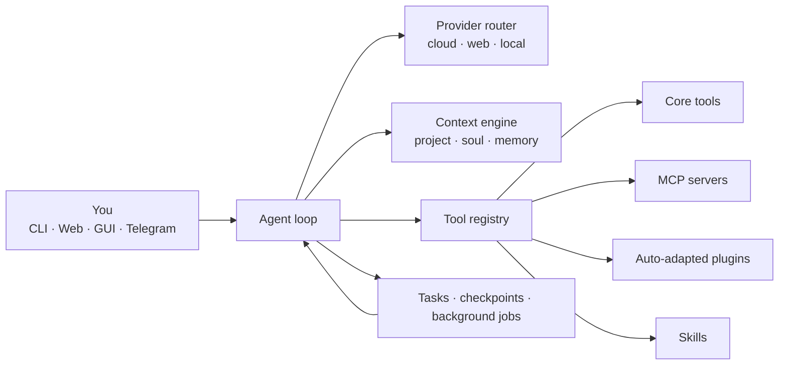

# Dulus

<p align="center">
  
</p>

<p align="center">
  <strong>One agentic CLI. Every model. Real tools. Your machine.</strong>
</p>

<p align="center">
  Dulus is an open-source agent runtime for the terminal: provider-independent, local-first,<br>
  extensible through MCP and arbitrary Python repositories, and built to keep working after the first prompt.
</p>

<p align="center">
  <a href="https://pypi.org/project/dulus/"></a>
  <a href="https://pypi.org/project/dulus/"></a>
  <a href="https://github.com/KevRojo/Dulus/releases"></a>
  <a href="https://github.com/KevRojo/Dulus/actions/workflows/ci.yml"></a>
  <a href="https://github.com/KevRojo/Dulus/pkgs/container/dulus"></a>
  
  <a href="LICENSE"></a>
</p>

<p align="center">
  <a href="#install-in-30-seconds"><strong>Install</strong></a> ·
  <a href="#why-dulus"><strong>Why Dulus</strong></a> ·
  <a href="#one-runtime-every-model"><strong>Models</strong></a> ·
  <a href="#turn-any-python-repo-into-tools"><strong>Extensions</strong></a> ·
  <a href="#agents-that-can-work-without-disappearing"><strong>Agents</strong></a> ·
  <a href="#one-engine-four-surfaces"><strong>Surfaces</strong></a> ·
  <a href="#command-map"><strong>Commands</strong></a> ·
  <a href="https://kevrojo.github.io/Dulus/"><strong>Live tour ↗</strong></a>
</p>

<p align="center">
  <a href="docs/README_ES.md">Español</a> ·
  <a href="docs/README_FR.md">Français</a> ·
  <a href="docs/README_ZH.md">中文</a> ·
  <a href="docs/README_JA.md">日本語</a> ·
  <a href="docs/README_KO.md">한국어</a> ·
  <a href="docs/README_PT.md">Português</a> ·
  <a href="docs/README_RU.md">Русский</a> ·
  <a href="docs/README_AR.md">العربية</a>
</p>

---

## Why Dulus

Most coding agents begin with a model and bolt tools around it. Dulus starts with the runtime.

The model can change mid-session. The tools can come from the core, MCP, a skill, or a Python repository that had never heard of Dulus five minutes earlier. Memory survives the session. Checkpoints cover both conversation and files. Long-running work moves into background jobs. The same engine can be operated from a terminal, browser, desktop app, Telegram, or Dulus OS.

That changes what the product is:

| Dulus is | Dulus is not |
|---|---|
| A provider-independent agent runtime | A skin over one model vendor |
| A readable Python codebase you can fork | A black box that only works in somebody else's cloud |
| A tool system with MCP, skills, plugins, and hot reload | A fixed list of commands chosen by the vendor |
| Local-first, with Ollama and LM Studio support | API-key-or-nothing software |
| Stateful: memory, tasks, checkpoints, background jobs | A disposable chat transcript |
| One engine with multiple interfaces | A terminal demo pretending to be a platform |

### The proof is in the repository

At the time of this release, Dulus contains approximately **56K lines of first-party Python**, **143 Python runtime modules**, **780+ tests**, **58 tagged releases**, and more than **400 commits shipped in the previous 90 days**.

Those numbers are not a vanity dashboard. They explain the product: Dulus is being built in public at production velocity. Read the [release notes](docs/news.md), inspect the [architecture](docs/architecture.md), or open the [interactive dependency graph](docs/api.html).

> **Hunt. Patch. Ship.** The loop is the product.

---

## Install in 30 seconds

If Python 3.11 or newer is already installed:

```bash
pip install dulus
dulus
```

The first-run wizard inspects the machine, recommends a right-sized local model, and can install Ollama for a zero-key, fully local start.

### Automatic installer

Linux, macOS, WSL, and Termux:

```bash
curl -fsSL https://raw.githubusercontent.com/KevRojo/Dulus/main/install.sh | bash
```

Windows PowerShell:

```powershell
iwr -useb https://raw.githubusercontent.com/KevRojo/Dulus/main/install.ps1 | iex
```

Windows users who do not want Python or a terminal can download the self-contained MSI from [GitHub Releases](https://github.com/KevRojo/Dulus/releases).

### Docker

```bash
docker run --rm -it \
  -v "${PWD}:/workspace" \
  -w /workspace \
  ghcr.io/kevrojo/dulus:latest
```

### From source

```bash
git clone https://github.com/KevRojo/Dulus
cd Dulus
python -m pip install -e .
dulus
```

### Pick any brain

```bash
# Cloud provider
export ANTHROPIC_API_KEY=sk-ant-...
dulus --model claude-sonnet-4-6

# Local and offline
ollama pull qwen2.5-coder
dulus --model ollama/qwen2.5-coder

# Unix pipeline
git diff | dulus -p "review this diff and find the dangerous parts"
```

No key yet? Start with Ollama, use NVIDIA NIM's free tier, or configure one of the supported browser-backed providers from the welcome flow.

---

## The runtime, not just the prompt



| Layer | What it does |
|---|---|
| **Provider router** | Streams from Anthropic, OpenAI, Gemini, DeepSeek, Kimi, Qwen, NVIDIA, Ollama, LM Studio, LiteLLM, and OpenAI-compatible endpoints |
| **Agent loop** | Chooses tools, executes them, reads the results, compacts context, and continues until the work is done |
| **Context engine** | Combines project instructions, conversation state, persistent memory, skills, and the active persona |
| **Tool registry** | Makes core tools, MCP tools, plugin tools, and skills look like one coherent capability surface |
| **Durable state** | Stores tasks, sessions, costs, memories, checkpoints, background jobs, and audit records |
| **Interfaces** | Exposes the same runtime through CLI, WebChat, native desktop GUI, Telegram, and Dulus OS |

The core stays readable on purpose. There is no TypeScript monorepo hiding the agent loop behind six packages. Start with [`dulus.py`](dulus.py), [`agent.py`](agent.py), [`providers.py`](providers.py), [`tools.py`](tools.py), and [`tool_registry.py`](tool_registry.py).

---

## One runtime, every model

Dulus does not make model choice an architectural decision. Switch providers during the same session with `/model`; tools, memory, tasks, and project context remain in place.

| Route | Providers |
|---|---|
| **Direct cloud APIs** | Anthropic · OpenAI · Gemini · DeepSeek · Kimi · Qwen · Zhipu · MiniMax · NVIDIA |
| **Unified gateway** | 100+ LiteLLM backends including OpenRouter, Groq, Together, Bedrock, Vertex AI, xAI, and Mistral |
| **Local** | Ollama · LM Studio · vLLM · any OpenAI-compatible endpoint |
| **Browser-backed** | Supported authenticated sessions for Claude, Gemini, Kimi, Qwen, and DeepSeek |
| **Free tier** | 14 models through NVIDIA NIM with automatic fallback |

```text
/model
/model claude-sonnet-4-6
/model nvidia-web/deepseek-r1
/model ollama/qwen2.5-coder
/config custom_base_url=http://your-gpu-box:8000/v1
/model custom/your-model
```

<p align="center">
  
</p>

When one NVIDIA model reaches its free-tier ceiling, the provider can fall through the configured chain instead of killing the session.

---

## Turn any Python repo into tools

MCP is supported natively, but Dulus does not stop there.

The **Auto-Adapter** can inspect an arbitrary Python repository, infer useful operations, generate a `plugin_tool.py`, install dependencies, validate the exports, and register the resulting tools in the current session.

<p align="center">
  
</p>

```text
/plugin install yfinance@https://github.com/ranaroussi/yfinance
/plugin reload

> get the current prices of NVDA, TSLA, and the S&P 500
```

### Three extension paths

| Path | Best for | How it becomes available |
|---|---|---|
| **MCP** | Standard servers and remote integrations | Drop in `.mcp.json` or use `/mcp install` |
| **Auto-Adapter plugins** | Existing Python repositories | `/plugin install name@https://repo` |
| **Skills** | Reusable workflows, instructions, and tool bundles | `/skills` or install into the skill directory |

The MCP marketplace indexes more than **2,000 servers**. Composio exposes **800+ ready-made skills and app integrations**. Auto-Adapter covers the long tail: code that nobody packaged for an agent.

```json
{
  "mcpServers": {
    "git": {
      "type": "stdio",
      "command": "uvx",
      "args": ["mcp-server-git"]
    },
    "playwright": {
      "type": "stdio",
      "command": "npx",
      "args": ["-y", "@playwright/mcp"]
    }
  }
}
```

```text
/mcp search postgres
/mcp install <name>
/mcp installed
/mcp reload
/plugin recommend
/plugin list
/skills
```

---

## Agents that can work without disappearing

Dulus can run typed sub-agents in isolated git worktrees, coordinate them through messages, and keep their work visible. A coder can implement while a reviewer inspects and a tester runs the suite.

The **Mesa Redonda** pushes the same idea across models: multiple model personas debate a decision in parallel while you retain the ability to interrupt one participant, broadcast to the table, or stop the run.

<p align="center">
  
</p>

```text
Agent(type="coder", task="implement the auth refactor")
Agent(type="reviewer", task="review the auth refactor")
Agent(type="tester", task="run focused and integration tests")

/agents
/brainstorm "rewrite in Rust or keep Python?"
/roundtable "design the migration plan"
```

### Long work belongs in the background

`TmuxOffload` moves a long-running tool into a detached tmux session, records the job under `~/.dulus/jobs/`, and returns control immediately. `ReadJob` retrieves the result, while the tmux session cleans itself up when finished.

This is the difference between “the UI did not freeze” and an actual background execution model.

---

## Memory you can inspect. Checkpoints you can trust.

Dulus stores memory as Markdown, not an opaque vendor profile.

| Scope | Location | Purpose |
|---|---|---|
| **User** | `~/.dulus/memory/` | Preferences, durable facts, recurring workflows |
| **Project** | `.dulus/memory/` | Architecture decisions, conventions, project context |

Memories are ranked by confidence and recency. Important entries can be marked gold. The directory can be opened directly as an Obsidian vault.

```text
/remember "use anyio for new async work"
/memory search async
/memory consolidate
```

Checkpoints snapshot both the conversation and touched files:

```text
/checkpoint
/checkpoint 042
/checkpoint clear
```

Rewinding means the files and the reasoning context return together.

---

## One engine, four surfaces

Dulus is terminal-native, not terminal-limited.

| Surface | Start it | What it is for |
|---|---|---|
| **CLI** | `dulus` | Fastest path to the full agent runtime |
| **WebChat** | `/webchat` | Streaming local web UI, mobile/LAN access, personas, and task manager |
| **Desktop GUI** | `python dulus_gui.py` | Native desktop history, settings, tasks, personas, and tool inspection |
| **Dulus OS** | `/os` or `dulus --os` | Browser desktop with windows, launcher, terminal, apps, memory, and agent controls |

<p align="center">
  
</p>

### WebChat and the task system

The browser is not a separate demo backend. It drives the same agent, registry, memory, and tasks as the CLI.

<p align="center">
  
  
</p>

Tasks can be created in the REPL, assigned to agents, viewed in WebChat, and completed from the desktop GUI:

```text
/task create "refactor auth"
/task assign 1 coder
/task list
/task done 1
```

### Voice and bridges

- Offline speech-to-text through Whisper.
- Offline wake words such as “hey dulus” and “oye dulus”.
- Text-to-speech with local and hosted engines.
- Telegram bridge with streaming responses, files, vision, voice, and per-chat routing.
- Local WebChat address for opening Dulus from another device on the same network.

```text
/voice
/wake set "hey dulus"
/tts
/telegram <bot_token> <chat_id>
```

---

## Permission model

Autonomy should be selectable, visible, and reversible.

| Mode | Behavior |
|---|---|
| `auto` | Read operations and known-safe shell commands run freely; writes and unsafe shell commands request approval |
| `manual` | Strict interactive approval mode for sensitive work |
| `accept-all` | Run without approval prompts; intended for trusted sandboxes and automation |
| `plan` | Read-only analysis; only the plan artifact is writable |

Switch with `/permissions <mode>` or start a non-interactive run with `--accept-all` when the environment is intentionally disposable.

Additional safety mechanisms include:

- Tool argument validation and centralized dispatch.
- Output truncation with full results persisted for explicit retrieval.
- Audit logging for mutating operations.
- Isolated worktrees for sub-agents.
- Checkpoints before risky work.
- WebChat authentication required when binding beyond loopback.

### Privacy

Telemetry is opt-in. Dulus asks once and sends nothing unless permission is granted.

If enabled, telemetry covers operational events such as `session_start`, `tool_used`, the Dulus version, OS, Python version, and provider/model name. It does **not** include prompts, responses, file contents, paths, API keys, emails, or usernames.

```text
/config telemetry=off
```

See [`analytics.py`](analytics.py) and the [security notes](docs/SECURITY.md) for the implementation.

---

## Command map

Type `/` and press Tab inside the REPL to explore the live command list.

| Area | Commands |
|---|---|
| Models | `/model` · `/nvidia` · `/ollama` |
| Sessions | `/save` · `/load` · `/resume` · `/compact` |
| Memory | `/remember` · `/memory` |
| Work | `/task` · `/agents` · `/worker` · `/checkpoint` |
| Extensions | `/mcp` · `/plugin` · `/skills` |
| Interfaces | `/webchat` · `/os` · `/telegram` |
| Voice | `/voice` · `/wake` · `/tts` |
| Control | `/permissions` · `/plan` · `/ssj` |
| Insight | `/status` · `/doctor` · `/cost` · `/tokens` · `/news` |
| Output | `/export` · `/copy` · `/verbose` |

<details>
<summary><strong>Core tool families</strong></summary>

| Family | Examples |
|---|---|
| Files and code | `Read` · `Write` · `Edit` · `Glob` · `Grep` · diagnostics |
| Execution | `Bash` · background tasks · `TmuxOffload` · `ReadJob` |
| Web | `WebFetch` · `WebSearch` · browser-backed tools |
| Memory | save · search · list · delete · consolidate |
| Agents | spawn · message · inspect · collect result |
| Tasks | create · update · assign · list |
| Skills and plugins | discover · install · execute · reload |
| MCP | configure · connect · register remote tools |

</details>

<details>
<summary><strong>Useful launch patterns</strong></summary>

```bash
dulus
dulus --model ollama/qwen2.5-coder
dulus -p "explain this repository"
dulus --accept-all -p "implement every TODO and run tests"
git diff | dulus -p "write a precise commit message"
```

</details>

---

## Build with Dulus

### Project instructions

Place a `CLAUDE.md` in the project root. Dulus injects it into the system context so the agent starts with the repository's stack, conventions, commands, and constraints.

### Development setup

```bash
git clone https://github.com/KevRojo/Dulus
cd Dulus
python -m venv .venv

# Windows
.venv\Scripts\activate

# Linux / macOS
source .venv/bin/activate

python -m pip install -e ".[dev]"
python -m pytest -q
pyright
```

### Repository map

```text
dulus/
├── dulus.py             entry point, REPL, commands, bridges
├── agent.py             streaming agent loop and tool dispatch
├── providers.py         cloud, browser-backed, gateway, local providers
├── tools.py             built-in tools and registry wiring
├── tool_registry.py     registration, validation, execution, persistence
├── context.py           system and project context assembly
├── compaction.py        long-session context compression
├── memory/              persistent memory and offloaded jobs
├── multi_agent/         sub-agents, messaging, worktrees
├── dulus_mcp/           MCP transports, config, marketplace
├── plugin/              plugin loader and Auto-Adapter
├── skill/               skill discovery and execution
├── checkpoint/          file and conversation rewind
├── task/                durable task tracking
├── voice/               STT, TTS, wake words
├── gui/                 native desktop application
├── webchat_ui/          local browser interface
├── sandbox/             Dulus OS source and built frontend
└── tests/               unit and integration coverage
```

Documentation:

- [Getting started](docs/GETTING_STARTED.md)
- [Architecture](docs/architecture.md)
- [API guide](docs/API.md)
- [Interactive dependency graph](docs/api.html)
- [Deployment](docs/DEPLOYMENT.md)
- [Contributing](docs/CONTRIBUTING.md)
- [Security](docs/SECURITY.md)
- [Release notes](docs/news.md)
- [Whitepaper](docs/Dulus_AI_Whitepaper_%28v2.0%29.pdf)

---

## Shipping in public

Dulus does not hide behind a quarterly roadmap. Features, fixes, experiments, reversals, and lessons ship in the open.

- More than **400 commits in 90 days** at this snapshot.
- **58 tagged versions** across the public history.
- Provider failures, packaging problems, installer issues, and community bug reports routinely become releases within the same day.
- The first Hacker News community bug report was diagnosed, fixed, tested, and released to PyPI the day it arrived.

Follow the evidence:

- [`docs/news.md`](docs/news.md) — human-readable release journal.
- [`docs/CHANGELOG.md`](docs/CHANGELOG.md) — structured changes.
- [GitHub Releases](https://github.com/KevRojo/Dulus/releases) — installable versions.
- [Commit history](https://github.com/KevRojo/Dulus/commits/main/) — the actual shipping rate.

This project is ambitious by design. If Dulus is not yet the best open agent CLI for your workflow, the repository is structured so you can help make it so.

---

## Ecosystem

| Surface | Role |
|---|---|
| [dulus.ai](https://dulus.ai/) | Product front door, cloud agent, and full ecosystem tour |
| [dulus.online](https://dulus.online/) | Synthetic Operations: deploy and govern persistent agent fleets |
| [dulus.work](https://dulus.work/) | Network and shared intelligence layer |
| [GitHub Pages](https://kevrojo.github.io/Dulus/) | Interactive open-source product demo |
| [Telegram](https://t.me/dulusx) | Community and release channel |
| [X / Twitter](https://x.com/KevRojo) | Builder updates |

Dulus has received support through startup programs from Cloudflare, AWS Activate, Datadog, Sentry, Anthropic, MongoDB, DigitalOcean, Notion, Zendesk, Deepgram, Mixpanel, and Amplitude.

---

## FAQ

<details>
<summary><strong>Does Dulus require an API key?</strong></summary>

No. Ollama and LM Studio run locally. NVIDIA NIM provides a free-tier route. Supported browser-backed providers can also be configured through the welcome flow. Cloud API keys remain available when you want direct paid access.

</details>

<details>
<summary><strong>Which local models work best with tools?</strong></summary>

Use a model trained for function calling, such as Qwen2.5-Coder, Llama 3.3, Mistral, or Phi-4. Base models without tool-use training may produce valid text but unreliable tool calls.

</details>

<details>
<summary><strong>Can Dulus use a remote GPU?</strong></summary>

Yes. Point `custom_base_url` at any OpenAI-compatible server:

```text
/config custom_base_url=http://your-server:8000/v1
/model custom/your-model
```

</details>

<details>
<summary><strong>Is <code>--accept-all</code> safe for production repositories?</strong></summary>

It deliberately removes approval prompts. Use it in trusted sandboxes or controlled automation. Use the default `auto` mode or read-only `plan` mode for sensitive environments.

</details>

<details>
<summary><strong>Can I use Dulus as a library?</strong></summary>

Yes. The agent loop, provider layer, registry, memory system, MCP client, and task system are regular Python modules. The [API guide](docs/API.md) and [dependency graph](docs/api.html) are the best entry points.

</details>

---

## License

Dulus is licensed under [GPLv3](LICENSE). You can use it, study it, modify it, and redistribute it. Derivative distributions must preserve the same open-source freedoms.

If Dulus saves you tokens, time, or sanity:

```text
BTC: 1JzatQDn9fMLnKTd3KYgztsLHC95bJEzSN
```

<p align="center">
  
</p>

<p align="center">
  <strong>Built by <a href="https://github.com/KevRojo">KevRojo</a> in the Dominican Republic.</strong><br>
  Named after the Cigua Palmera, not the rocket.<br>
  <a href="https://x.com/KevRojo">@KevRojo</a> · <a href="https://t.me/dulusx">t.me/dulusx</a>
</p>
