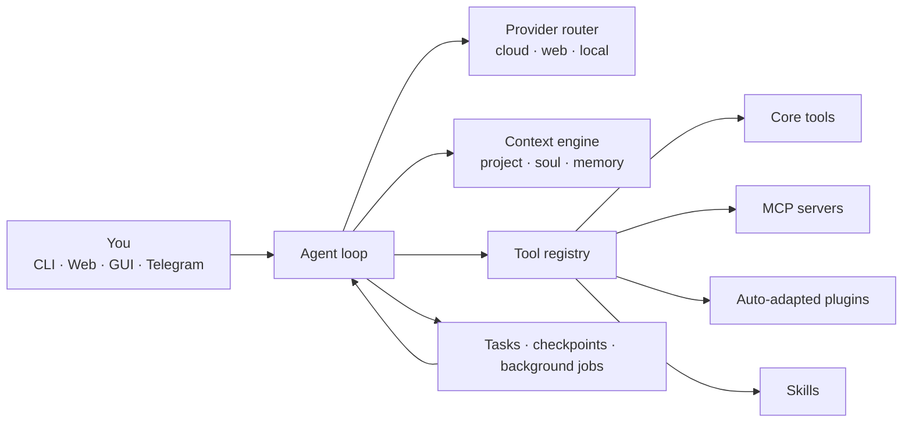

# Dulus

<p align="center">
  
</p>

<p align="center">
  <a href="#fuel--reload-wallet-qr-ready"><strong>⛽ /fuel walkthrough →</strong></a>
  ·
  <a href="#get-your-dulus-api-key-no-website-required"><strong>🔑 API key from pip →</strong></a>
  ·
  <a href="https://dulus.online"><strong>🚀 dulus.online</strong></a>
</p>

<p align="center">
  <strong>🖥️ Prefer a desktop app?</strong> Download <strong>Dulus Premium</strong> — a signed, auto-updating build for Windows, macOS and Linux.<br>
  <a href="https://github.com/Dulus-Ai/dulus-updates/releases/latest"><strong>⬇️ Download the latest binaries → github.com/Dulus-Ai/dulus-updates</strong></a>
</p>

<p align="center">
  <a href="https://pypi.org/project/dulus/"></a>
  <a href="https://pypi.org/project/dulus/"></a>
  <a href="https://github.com/KevRojo/Dulus/releases"></a>
  <a href="https://github.com/KevRojo/Dulus/actions/workflows/ci.yml"></a>
  <a href="https://github.com/KevRojo/Dulus/pkgs/container/dulus"></a>
  
  <a href="LICENSE"></a>
</p>

<p align="center">
  <a href="#install-in-30-seconds"><strong>Install</strong></a> ·
  <a href="#get-your-dulus-api-key-no-website-required"><strong>API key</strong></a> ·
  <a href="#fuel--reload-wallet-qr-ready"><strong>Fuel / QR</strong></a> ·
  <a href="#why-dulus"><strong>Why Dulus</strong></a> ·
  <a href="#one-runtime-every-model"><strong>Models</strong></a> ·
  <a href="#turn-any-python-repo-into-tools"><strong>Extensions</strong></a> ·
  <a href="#agents-that-can-work-without-disappearing"><strong>Agents</strong></a> ·
  <a href="#one-engine-four-surfaces"><strong>Surfaces</strong></a> ·
  <a href="#command-map"><strong>Commands</strong></a> ·
  <a href="https://kevrojo.github.io/Dulus/"><strong>Live tour ↗</strong></a>
</p>

<p align="center">
  <a href="docs/README_ES.md">Español</a> ·
  <a href="docs/README_FR.md">Français</a> ·
  <a href="docs/README_ZH.md">中文</a> ·
  <a href="docs/README_JA.md">日本語</a> ·
  <a href="docs/README_KO.md">한국어</a> ·
  <a href="docs/README_PT.md">Português</a> ·
  <a href="docs/README_RU.md">Русский</a> ·
  <a href="docs/README_AR.md">العربية</a>
</p>

<p align="center">  </p>


<p align="center">
  Dulus is an open-source agent runtime that hands you a real AI agent the moment you install it —<br>
  talking to Gemini, Claude and GPT through their own web sessions, so you owe no one a key or a cent.<br>
  One runtime. Every model. Your machine. The whole world invited.

  Now on 6.0.5 🚀 — for the best experience get the binaries from https://dulus.ai/ there are free models on my /dulus/dulus-* providers, love you guys!

  God bless you! ♥
</p>

<p align="center">
  <strong>⚡ Outgrew local? <a href="https://dulus.online">Dulus AI</a> is the hosted platform.</strong><br>
  <strong>12 models behind one OpenAI-compatible router</strong> — from a nimble 9B to a 397B heavyweight,
  including a <strong>Qwen-based uncensored flagship</strong> that answers straight, self-hosted, no gatekeeping.<br>
  Fuel it with <strong><a href="https://dulus.online">$DULUS</a></strong> — the utility token that <em>is</em> your AI credit:
  on-chain, transferable, spent by the token. No plan approvals, no frozen accounts.<br>
  Point your OpenAI SDK at <code>https://control.dulus.ai/v1</code> and go.
</p>

<p align="center">
  <strong>🔑 Need an API key?</strong> Stop waiting on the website.<br>
  It has been in <strong>dulus-public (pip)</strong> forever — mint it from the CLI:
</p>

```bash
pip install -U dulus
dulus
# inside the REPL:
/login dulus        # sign in (OAuth — browser opens)
/login dulus key    # mint a dulus_sk_* key (shown once)
```

```bash
# then point anything OpenAI-compatible at the router
export OPENAI_API_KEY='dulus_sk_...'          # the key you just minted
export OPENAI_BASE_URL='https://control.dulus.ai/v1'
# or:  openai.base_url = "https://control.dulus.ai/v1"
```

<p align="center">
  <em>Damn brother… are you really waiting for the website update to get your API key?</em><br>
  That’s on Dulus-public since years. Have fun. It was a surprise u,u — <strong>$DULUS</strong>
</p>

<p align="center">
  <a href="#get-your-dulus-api-key-no-website-required"><strong>🔑 Get your API key from pip →</strong></a>
  ·
  <a href="https://dulus.online"><strong>🚀 Platform → dulus.online</strong></a>
</p>


<p align="center">
  <strong>⛽ $DULUS Fuel is LIVE in the CLI — <code>/fuel</code> is ready.</strong><br>
  Sign in, get your <strong>reload wallet as a console QR</strong>, scan with Phantom / Solflare,<br>
  send <strong>$DULUS</strong>, and Fuel credits hit your account. Utility coin that actually powers AI.
</p>

```bash
pip install -U dulus
dulus
# inside the REPL:
/login dulus     # sign in
/fuel            # balance + scannable reload-wallet QR
/fuel deposit    # QR only
```

<p align="center">
  <em>Tested. Reloaded. Fuel credited.</em> We’re not playing points — this is on-chain gas for inference.<br>
  <strong>$DULUS</strong> · <code>control.dulus.ai/v1</code> · 12+ models · spent by the token 🦅
</p>


---

## Free frontier AI. No key, no catch.

Every other AI tool starts the same way: *paste your API key, add a card, watch the meter run.* Dulus starts differently.

```bash
pip install dulus
dulus
```

On a fresh machine that's the whole setup — Dulus boots straight into **Gemini, free, with no API key and no account.** Here's the part nobody else does:

- Dulus opens Gemini in a **headless browser**, captures the **anonymous web session** (it doesn't even ask you to sign in), and then talks to Gemini's real endpoint **as if you were the one typing in the tab.**
- No API, no billing, no quota to buy. The same frontier model — reached the way a human reaches it.
- The same trick works for **Claude, ChatGPT, DeepSeek, Qwen, Kimi.** Dulus harvests each service's web session and speaks its protocol, so your ChatGPT Plus or Claude subscription becomes an agent backend with **one command and zero keys.**

Rather use keys, local models, or your own endpoint? Dulus does that too — **34 providers** in a single runtime (cloud API, local Ollama/LM Studio, OAuth, and web-session). But the free default is the whole point: **you shouldn't need a corporation's permission to have an agent.**

---

---

## Fuel + reload wallet QR (READY)

**`/fuel` is ready.** Top up AI compute with **$DULUS** — the utility token that *is* your credit.

```text
/login dulus      # OAuth — browser opens
/fuel             # ⛽ balance + console QR of YOUR reload wallet
/fuel deposit     # address + QR only
/fuel balance     # balance only
```

1. Run `/fuel` — Dulus prints your unique Solana deposit address **and a terminal QR** (segno, scannable).
2. Open **Phantom / Solflare** → scan the QR → send **$DULUS**.
3. Control plane credits **Fuel** to your account.
4. Burn it on `dulus-*` models via the CLI or `https://control.dulus.ai/v1`.

No website form. No waiting on a dashboard refresh to *see* the wallet. The QR is in your terminal the second you login.

```bash
pip install -U dulus   # includes segno for console QR
dulus
```

| Command | What you get |
|---|---|
| `/login dulus` | Sign in + reload QR on success |
| `/fuel` | Balance + reload wallet QR |
| `/fuel deposit` | QR / address only |
| `/login dulus key` | Mint `dulus_sk_*` for OpenAI SDK → same Fuel pool |

**$DULUS** = on-chain gas for inference. Transferable. Spent by the token. Tested end-to-end — reload lands, Fuel credits. 🦅

---

## Get your Dulus API key (no website required)

Damn brother… are you really waiting for the website update to get your API key?

**You don’t need the website.** Minting a `dulus_sk_*` key has been in **dulus-public** (`pip install dulus`) for ages. The CLI talks straight to the control plane.

```bash
pip install -U dulus
dulus
```

Inside the REPL:

```text
/login dulus        # sign in (OAuth PKCE — browser opens, no API key pasted by hand)
/login dulus key    # mint a dulus_sk_* key for CI, SDKs, servers (shown once — copy it)
```

Then point **any** OpenAI-compatible client at the router and burn **$DULUS** fuel by the token:

```bash
export OPENAI_API_KEY='dulus_sk_...' 
export OPENAI_BASE_URL='https://control.dulus.ai/v1'
```

```python
from openai import OpenAI
client = OpenAI(
    api_key="dulus_sk_...",                 # from /login dulus key
    base_url="https://control.dulus.ai/v1",
)
r = client.chat.completions.create(
    model="dulus-a-9b",  # or dulus-b-27b, dulus-x-397b, …
    messages=[{"role": "user", "content": "hola desde el router"}],
)
print(r.choices[0].message.content)
```

Or stay inside Dulus and use the built-in provider (same login, Fuel-metered):

```text
/login dulus
/model dulus-a-9b
```

| Want | Do this |
|---|---|
| Interactive agent on Dulus models | `/login dulus` then `/model dulus-*` |
| API key for scripts / CI / other tools | `/login dulus key` → `dulus_sk_*` |
| OpenAI SDK / anything compatible | `base_url=https://control.dulus.ai/v1` + that key |
| Fuel (`$DULUS`) | Spent per token on the control plane — utility coin, not a wallpaper ticker |

It was a surprise u,u — have fun. 🦅 **$DULUS**

---

## New — Python console: a live heap that costs no tokens

> 🧪 Fresh out of the private build. Try it and tell me how it feels.

When an agent explores a big thing — a directory tree, a parsed file, an API dump — the result normally lands in the conversation and gets **re-sent every turn** for the rest of the session. The new **`Python` console** is a persistent REPL whose variables *survive across calls*: scan once into a variable, then filter and aggregate it across turns while the model only ever prints the small slice it needs. The data lives in the kernel's heap, not the chat — so you never pay tokens to re-read or re-transmit it. **Working memory outside the context window.**

<p align="center">
  
</p>

Real run: **101,619 files** scanned into a variable, then queried three ways across separate calls — the context only ever saw a number, an 8-line slice, and a one-line summary. Roughly **1.5–2M tokens that never touched the conversation.** It runs in an isolated subprocess kernel (an infinite loop kills the kernel, never Dulus) and caps output at the *source* so one giant line can't flood the context. **Full write-up → [The model's second brain](docs/python-console.md).**

---

## New — Lookback: keep 2,000 turns, pay for 20

> 🧪 Fresh out of the private build. I'd love for you to try it and tell me how it feels.

Long agent sessions bleed tokens: every turn replays the *entire* history to the model. **Lookback** splits what the model *sees* from what you *keep* — the API gets a sliding window of only the last N user turns, while the full conversation stays saved locally. That local archive is **loopback**: re-open or search it anytime with `/loopback`, and a gold `short_memory` rides alongside so the model never loses the thread.

<p align="center">
  
</p>

The clever part: the window is **anchored**, so the API prefix stays stable between jumps — a naively sliding window rewrites the prefix every turn, busts the provider's prompt cache, and costs *more* than it saves. Three months on my own machine, this discipline bought: **5.9B tokens through Claude · 98.8% cache hit rate · on a single $20 plan.**

```bash
/lookback on                                # send only the recent window to the API
/loopback search "that thing we decided"    # pull anything back from the full archive
```

Try it and hit me with feedback — it's the token trick I'm proudest of.

---

## New — Signed binaries, maintained by me

> 📢 The fastest way to run Dulus is the prebuilt app — I keep it updated myself.

The public `pip install dulus` gives you the full open-source runtime. But if you want the **smoothest experience** — auto-updating, code-signed, zero Python setup — grab the **prebuilt binaries** for Windows, macOS and Linux. I maintain those builds personally so they always ship the latest fixes first.

<p align="center">
  <a href="https://dulus.ai/"><strong>⬇️ Download the binaries → dulus.ai</strong></a> ·
  <a href="https://github.com/Dulus-Ai/dulus-updates/releases/latest"><strong>GitHub Releases ↗</strong></a>
</p>

The **premium/desktop core is closed-source on purpose** — that code stays private so it can't be leaked, cloned, or stripped of its license gate. This public repo is the real runtime you can read, fork and build on; the signed binaries are the same runtime plus the private polish, kept safe on my side. Best of both: **open where it counts, protected where it matters.**

---

## A note from the builder

I'm one developer. No team, no funding, no VC deck — just me, a laptop, and a stubborn little bird from the Dominican Republic. 🇩🇴

I've poured months into Dulus. Some days it feels like building the loudest thing in an empty room — like nobody's paying attention. And the honest truth: I've spent so long *building* the features that could genuinely rattle this industry that I've barely *shown* them. That changes now.

Because this isn't a toy demo. Dulus already does things the funded wrappers can't:

- **frontier AI with no keys** (the web-session engine above),
- a **Round Table** where several real models argue their way to a better answer,
- an **auto-adapter** that installs its own missing tools when it hits a wall,
- **2,186+ MCP tools**, **100,000 skills**, memory, voice, sub-agents,
- one runtime driving a terminal, a browser, a desktop app, and a full sandbox OS.

My goal is simple and stubborn: **put a real agentic AI in the hands of anyone with a terminal — for free — while the door is still open.** If that mission means something to you, star the repo, run one command, tell one person. Help the Cigua fly. 🦅

— Kevin ([@KevRojo](https://x.com/KevRojo)) · Santo Domingo 🇩🇴

---

## Why Dulus

Most coding agents begin with a model and bolt tools around it. Dulus starts with the runtime.

The model can change mid-session. The tools can come from the core, MCP, a skill, or a Python repository that had never heard of Dulus five minutes earlier. Memory survives the session. Checkpoints cover both conversation and files. Long-running work moves into background jobs. The same engine can be operated from a terminal, browser, desktop app, Telegram, or Dulus OS.

That changes what the product is:

| Dulus is | Dulus is not |
|---|---|
| A provider-independent agent runtime | A skin over one model vendor |
| A readable Python codebase you can fork | A black box that only works in somebody else's cloud |
| A tool system with MCP, skills, plugins, and hot reload | A fixed list of commands chosen by the vendor |
| Local-first, with Ollama and LM Studio support | API-key-or-nothing software |
| Stateful: memory, tasks, checkpoints, background jobs | A disposable chat transcript |
| One engine with multiple interfaces | A terminal demo pretending to be a platform |

### The proof is in the repository

At the time of this release, Dulus contains approximately **56K lines of first-party Python**, **143 Python runtime modules**, **780+ tests**, **58 tagged releases**, and more than **400 commits shipped in the previous 90 days**.

Those numbers are not a vanity dashboard. They explain the product: Dulus is being built in public at production velocity. Read the [release notes](docs/news.md), inspect the [architecture](docs/architecture.md), or open the [interactive dependency graph](docs/api.html).

> **Hunt. Patch. Ship.** The loop is the product.

---

## Install in 30 seconds

If Python 3.11 or newer is already installed:

```bash
pip install dulus
dulus
```

The first-run wizard inspects the machine, recommends a right-sized local model, and can install Ollama for a zero-key, fully local start.

### Automatic installer

Linux, macOS, WSL, and Termux:

```bash
curl -fsSL https://raw.githubusercontent.com/KevRojo/Dulus/main/install.sh | bash
```

Windows PowerShell:

```powershell
iwr -useb https://raw.githubusercontent.com/KevRojo/Dulus/main/install.ps1 | iex
```

Windows users who do not want Python or a terminal can download the self-contained MSI from [GitHub Releases](https://github.com/KevRojo/Dulus/releases).

### Dulus for Windows — desktop app (alpha/beta trial)

The full **Dulus desktop app** for Windows is now in open trial. No Python, no terminal, no API key — download, install, sign in, and go.

**[⬇️ Dulus Windows Trial setup (alpha/beta)](https://drive.google.com/file/d/1Nxz_coVpXRwKQB7baI_0nG12-p1cLznZ/view)**

It is early — expect rough edges, and tell us about them in [Issues](https://github.com/KevRojo/Dulus/issues). The CLI in this repository stays free and open source; the desktop app is the same engine with a face.

### Docker

```bash
docker run --rm -it \
  -v "${PWD}:/workspace" \
  -w /workspace \
  ghcr.io/kevrojo/dulus:latest
```

### From source

```bash
git clone https://github.com/KevRojo/Dulus
cd Dulus
python -m pip install -e .
dulus
```

### Pick any brain

```bash
# Dulus router (Fuel / $DULUS) — no website key form
dulus
# /login dulus
# /login dulus key          # mint dulus_sk_* for SDKs
# /model dulus-a-9b

# Cloud provider key
export ANTHROPIC_API_KEY=sk-ant-...
dulus --model claude-sonnet-4-6

# Local and offline
ollama pull qwen2.5-coder
dulus --model ollama/qwen2.5-coder

# Unix pipeline
git diff | dulus -p "review this diff and find the dangerous parts"
```

No third-party key yet? Use **`/login dulus`** for the hosted router, start with Ollama, NVIDIA NIM's free tier, or a browser-backed provider from the welcome flow.

---

## The runtime, not just the prompt


```mermaid
flowchart LR
    U["You<br/>CLI · Web · GUI · Telegram"] --> A["Agent loop"]
    A --> P["Provider router<br/>cloud · web · local"]
    A --> C["Context engine<br/>project · soul · memory"]
    A --> R["Tool registry"]
    R --> T["Core tools"]
    R --> M["MCP servers"]
    R --> X["Auto-adapted plugins"]
    R --> S["Skills"]
    A --> J["Tasks · checkpoints · background jobs"]
    J --> A
```

| Layer | What it does |
|---|---|
| **Provider router** | Streams from Anthropic, OpenAI, Gemini, DeepSeek, Kimi, Qwen, NVIDIA, Ollama, LM Studio, LiteLLM, and OpenAI-compatible endpoints |
| **Agent loop** | Chooses tools, executes them, reads the results, compacts context, and continues until the work is done |
| **Context engine** | Combines project instructions, conversation state, persistent memory, skills, and the active persona |
| **Tool registry** | Makes core tools, MCP tools, plugin tools, and skills look like one coherent capability surface |
| **Durable state** | Stores tasks, sessions, costs, memories, checkpoints, background jobs, and audit records |
| **Interfaces** | Exposes the same runtime through CLI, WebChat, native desktop GUI, Telegram, and Dulus OS |

The core stays readable on purpose. There is no TypeScript monorepo hiding the agent loop behind six packages. Start with [`dulus.py`](dulus.py), [`agent.py`](agent.py), [`providers.py`](providers.py), [`tools.py`](tools.py), and [`tool_registry.py`](tool_registry.py).

---

## One runtime, every model

Dulus does not make model choice an architectural decision. Switch providers during the same session with `/model`; tools, memory, tasks, and project context remain in place.

| Route | Providers |
|---|---|
| **Direct cloud APIs** | Anthropic · OpenAI · Gemini · DeepSeek · Kimi · Qwen · Zhipu · MiniMax · NVIDIA |
| **Unified gateway** | 100+ LiteLLM backends including OpenRouter, Groq, Together, Bedrock, Vertex AI, xAI, and Mistral |
| **Local** | Ollama · LM Studio · vLLM · any OpenAI-compatible endpoint |
| **Edge / on-device** | `edge/*` — small models on your phone or in Termux via llama.cpp / Ollama |
| **Browser-backed** | Supported authenticated sessions for Claude, Gemini, Kimi, Qwen, and DeepSeek |
| **Dulus router (`$DULUS` Fuel)** | `dulus-*` models on `https://control.dulus.ai/v1` — `/login dulus` or `dulus_sk_*` from `/login dulus key` |
| **Free tier** | 14 models through NVIDIA NIM with automatic fallback |

```text
/model
/login dulus
/model dulus-a-9b
/model dulus-b-27b
/model dulus-x-397b
/model claude-sonnet-4-6
/model nvidia-web/deepseek-r1
/model ollama/qwen2.5-coder
/config custom_base_url=http://your-gpu-box:8000/v1
/model custom/your-model
```

<p align="center">
  
</p>

When one NVIDIA model reaches its free-tier ceiling, the provider can fall through the configured chain instead of killing the session.

### On the edge — your phone, Termux, on-device

The `edge` provider runs a small model **locally**, with no per-token cost and no cloud round-trip. It's backend-agnostic: point it at any OpenAI-compatible server on `127.0.0.1` and it just works.

```bash
# The path that works today — llama.cpp on a laptop, a VM, or Termux on Android
llama-server -m gemma-3-1b-it-Q4_K_M.gguf --port 8080
dulus --model edge/gemma-3-1b

# Already running Ollama? Point edge at it instead
dulus --config edge_base_url=http://127.0.0.1:11434/v1
```

Override the host/port for a phone on your LAN with `DULUS_EDGE_BASE_URL` or `/config edge_base_url=...`. A full **Termux install walkthrough** lives in [`docs/termux-edge.md`](docs/termux-edge.md).

> **Gemma Nano on-device (APK) — work in progress.** A native Android bridge that runs Gemma directly on the phone's NPU via AICore (zero download, hardware-accelerated) is being built and will take time to ship. Until then, `edge/*` gets you fully local models on the same phone through llama.cpp in Termux — no APK required.

---

## Turn any Python repo into tools

MCP is supported natively, but Dulus does not stop there.

The **Auto-Adapter** can inspect an arbitrary Python repository, infer useful operations, generate a `plugin_tool.py`, install dependencies, validate the exports, and register the resulting tools in the current session.

<p align="center">
  
</p>

```text
/plugin install yfinance@https://github.com/ranaroussi/yfinance
/plugin reload

> get the current prices of NVDA, TSLA, and the S&P 500
```

### Three extension paths

| Path | Best for | How it becomes available |
|---|---|---|
| **MCP** | Standard servers and remote integrations | Drop in `.mcp.json` or use `/mcp install` |
| **Auto-Adapter plugins** | Existing Python repositories | `/plugin install name@https://repo` |
| **Skills** | Reusable workflows, instructions, and tool bundles | `/skills` or install into the skill directory |

The MCP marketplace indexes more than **2,000 servers**. Composio exposes **800+ ready-made skills and app integrations**. Auto-Adapter covers the long tail: code that nobody packaged for an agent.

```json
{
  "mcpServers": {
    "git": {
      "type": "stdio",
      "command": "uvx",
      "args": ["mcp-server-git"]
    },
    "playwright": {
      "type": "stdio",
      "command": "npx",
      "args": ["-y", "@playwright/mcp"]
    }
  }
}
```

```text
/mcp search postgres
/mcp install <name>
/mcp installed
/mcp reload
/plugin recommend
/plugin list
/skills
```

---

## Agents that can work without disappearing

Dulus can run typed sub-agents in isolated git worktrees, coordinate them through messages, and keep their work visible. A coder can implement while a reviewer inspects and a tester runs the suite.

The **Mesa Redonda** pushes the same idea across models: multiple model personas debate a decision in parallel while you retain the ability to interrupt one participant, broadcast to the table, or stop the run.

<p align="center">
  
</p>

```text
Agent(type="coder", task="implement the auth refactor")
Agent(type="reviewer", task="review the auth refactor")
Agent(type="tester", task="run focused and integration tests")

/agents
/brainstorm "rewrite in Rust or keep Python?"
/roundtable "design the migration plan"
```

### Long work belongs in the background

`TmuxOffload` moves a long-running tool into a detached tmux session, records the job under `~/.dulus/jobs/`, and returns control immediately. `ReadJob` retrieves the result, while the tmux session cleans itself up when finished.

This is the difference between “the UI did not freeze” and an actual background execution model.

---

## Memory you can inspect. Checkpoints you can trust.

Dulus stores memory as Markdown, not an opaque vendor profile.

| Scope | Location | Purpose |
|---|---|---|
| **User** | `~/.dulus/memory/` | Preferences, durable facts, recurring workflows |
| **Project** | `.dulus/memory/` | Architecture decisions, conventions, project context |

Memories are ranked by confidence and recency. Important entries can be marked gold. The directory can be opened directly as an Obsidian vault.

```text
/remember "use anyio for new async work"
/memory search async
/memory consolidate
```

Checkpoints snapshot both the conversation and touched files:

```text
/checkpoint
/checkpoint 042
/checkpoint clear
```

Rewinding means the files and the reasoning context return together.

---

## One engine, four surfaces

Dulus is terminal-native, not terminal-limited.

| Surface | Start it | What it is for |
|---|---|---|
| **CLI** | `dulus` | Fastest path to the full agent runtime |
| **WebChat** | `/webchat` | Streaming local web UI, mobile/LAN access, personas, and task manager |
| **Desktop GUI** | `python dulus_gui.py` | Native desktop history, settings, tasks, personas, and tool inspection |
| **Dulus OS** | `/os` or `dulus --os` | Browser desktop with windows, launcher, terminal, apps, memory, and agent controls |

<p align="center">
  
</p>

### WebChat and the task system

The browser is not a separate demo backend. It drives the same agent, registry, memory, and tasks as the CLI.

<p align="center">
  
  
</p>

Tasks can be created in the REPL, assigned to agents, viewed in WebChat, and completed from the desktop GUI:

```text
/task create "refactor auth"
/task assign 1 coder
/task list
/task done 1
```

### Voice and bridges

- Offline speech-to-text through Whisper.
- Offline wake words such as “hey dulus” and “oye dulus”.
- Text-to-speech with local and hosted engines.
- Telegram bridge with streaming responses, files, vision, voice, and per-chat routing.
- Local WebChat address for opening Dulus from another device on the same network.

```text
/voice
/wake set "hey dulus"
/tts
/telegram <bot_token> <chat_id>
```

---

## Permission model

Autonomy should be selectable, visible, and reversible.

| Mode | Behavior |
|---|---|
| `auto` | Read operations and known-safe shell commands run freely; writes and unsafe shell commands request approval |
| `manual` | Strict interactive approval mode for sensitive work |
| `accept-all` | Run without approval prompts; intended for trusted sandboxes and automation |
| `plan` | Read-only analysis; only the plan artifact is writable |

Switch with `/permissions <mode>` or start a non-interactive run with `--accept-all` when the environment is intentionally disposable.

Additional safety mechanisms include:

- Tool argument validation and centralized dispatch.
- Output truncation with full results persisted for explicit retrieval.
- Audit logging for mutating operations.
- Isolated worktrees for sub-agents.
- Checkpoints before risky work.
- WebChat authentication required when binding beyond loopback.

### Privacy

Telemetry is opt-in. Dulus asks once and sends nothing unless permission is granted.

If enabled, telemetry covers operational events such as `session_start`, `tool_used`, the Dulus version, OS, Python version, and provider/model name. It does **not** include prompts, responses, file contents, paths, API keys, emails, or usernames.

```text
/config telemetry=off
```

See [`analytics.py`](analytics.py) and the [security notes](docs/SECURITY.md) for the implementation.

---

## Command map

Type `/` and press Tab inside the REPL to explore the live command list.

| Area | Commands |
|---|---|
| Account / Fuel | `/login dulus` · `/login dulus key` (mint `dulus_sk_*`) |
| Models | `/model` · `/nvidia` · `/ollama` · `dulus-*` on the router |
| Sessions | `/save` · `/load` · `/resume` · `/compact` |
| Memory | `/remember` · `/memory` |
| Work | `/task` · `/agents` · `/worker` · `/checkpoint` |
| Extensions | `/mcp` · `/plugin` · `/skills` |
| Interfaces | `/webchat` · `/os` · `/telegram` |
| Voice | `/voice` · `/wake` · `/tts` |
| Control | `/permissions` · `/plan` · `/ssj` |
| Insight | `/status` · `/doctor` · `/cost` · `/tokens` · `/news` |
| Output | `/export` · `/copy` · `/verbose` |

<details>
<summary><strong>Core tool families</strong></summary>

| Family | Examples |
|---|---|
| Files and code | `Read` · `Write` · `Edit` · `Glob` · `Grep` · diagnostics |
| Execution | `Bash` · background tasks · `TmuxOffload` · `ReadJob` |
| Web | `WebFetch` · `WebSearch` · browser-backed tools |
| Memory | save · search · list · delete · consolidate |
| Agents | spawn · message · inspect · collect result |
| Tasks | create · update · assign · list |
| Skills and plugins | discover · install · execute · reload |
| MCP | configure · connect · register remote tools |

</details>

<details>
<summary><strong>Useful launch patterns</strong></summary>

```bash
dulus
dulus --model ollama/qwen2.5-coder
dulus -p "explain this repository"
dulus --accept-all -p "implement every TODO and run tests"
git diff | dulus -p "write a precise commit message"
```

</details>

---

## Build with Dulus

### Project instructions

Place a `CLAUDE.md` in the project root. Dulus injects it into the system context so the agent starts with the repository's stack, conventions, commands, and constraints.

### Run Dulus from another program

`--output json` turns a one-shot run into a machine-readable stream, so Dulus can be embedded as the agent runtime behind another tool, an IDE bridge, or a CI job.

```bash
dulus -p --accept-all --output json -- "explain this repository"
```

The contract:

| Channel | Carries |
| --- | --- |
| **stdout** | JSONL protocol frames, and nothing else |
| **stderr** | Banner, spinners, tool status, warnings — every human-facing byte |

Frames use the OpenCode event-stream dialect, so a consumer that already parses that format needs no new adapter:

| Frame | Payload |
| --- | --- |
| `step_start` | `sessionID` |
| `text` | `part.text` — the assistant's answer |
| `step_finish` | `part.tokens.input` · `.output` · `.cache.read` · `.cache.write` · `part.cost` |
| `error` | `message` |

Exit code is `0` on success, `130` on Ctrl+C, and non-zero on any failure — a missing credential, a provider error, an unhandled exception, or a turn that produced no answer at all — always alongside an `error` frame. A run that streams partial text and then fails is a failure, not a partial success. Pass the prompt after `--`: it is a positional argument, so without the terminator a prompt starting with a hyphen is parsed as a flag.

`--version` and `--help` always answer on stdout, in every mode.

### Development setup

```bash
git clone https://github.com/KevRojo/Dulus
cd Dulus
python -m venv .venv

# Windows
.venv\Scripts\activate

# Linux / macOS
source .venv/bin/activate

python -m pip install -e ".[dev]"
python -m pytest -q
pyright
```

### Repository map

```text
dulus/
├── dulus.py             entry point, REPL, commands, bridges
├── agent.py             streaming agent loop and tool dispatch
├── providers.py         cloud, browser-backed, gateway, local providers
├── tools.py             built-in tools and registry wiring
├── tool_registry.py     registration, validation, execution, persistence
├── context.py           system and project context assembly
├── compaction.py        long-session context compression
├── memory/              persistent memory and offloaded jobs
├── multi_agent/         sub-agents, messaging, worktrees
├── dulus_mcp/           MCP transports, config, marketplace
├── plugin/              plugin loader and Auto-Adapter
├── skill/               skill discovery and execution
├── checkpoint/          file and conversation rewind
├── task/                durable task tracking
├── voice/               STT, TTS, wake words
├── gui/                 native desktop application
├── webchat_ui/          local browser interface
├── sandbox/             Dulus OS source and built frontend
└── tests/               unit and integration coverage
```

Documentation:

- [Getting started](docs/GETTING_STARTED.md)
- [Architecture](docs/architecture.md)
- [API guide](docs/API.md)
- [Interactive dependency graph](docs/api.html)
- [Deployment](docs/DEPLOYMENT.md)
- [Contributing](docs/CONTRIBUTING.md)
- [Security](docs/SECURITY.md)
- [Release notes](docs/news.md)
---

## Shipping in public

Dulus does not hide behind a quarterly roadmap. Features, fixes, experiments, reversals, and lessons ship in the open.

- More than **400 commits in 90 days** at this snapshot.
- **58 tagged versions** across the public history.
- Provider failures, packaging problems, installer issues, and community bug reports routinely become releases within the same day.
- The first Hacker News community bug report was diagnosed, fixed, tested, and released to PyPI the day it arrived.

Follow the evidence:

- [`docs/news.md`](docs/news.md) — human-readable release journal.
- [`docs/CHANGELOG.md`](docs/CHANGELOG.md) — structured changes.
- [GitHub Releases](https://github.com/KevRojo/Dulus/releases) — installable versions.
- [Commit history](https://github.com/KevRojo/Dulus/commits/main/) — the actual shipping rate.

This project is ambitious by design. If Dulus is not yet the best open agent CLI for your workflow, the repository is structured so you can help make it so.

---

## Ecosystem

| Surface | Role |
|---|---|
| [dulus.ai](https://dulus.ai/) | Product front door, cloud agent, and full ecosystem tour |
| [dulus.online](https://dulus.online/) | Synthetic Operations: deploy and govern persistent agent fleets |
| [dulus.work](https://dulus.work/) | Network and shared intelligence layer |
| [GitHub Pages](https://kevrojo.github.io/Dulus/) | Interactive open-source product demo |
| [Telegram](https://t.me/dulusx) | Community and release channel |
| [X / Twitter](https://x.com/KevRojo) | Builder updates |

Dulus has received support through startup programs from Cloudflare, AWS Activate, Datadog, Sentry, Anthropic, MongoDB, DigitalOcean, Notion, Zendesk, Deepgram, Mixpanel, and Amplitude.

---

## FAQ

<details>
<summary><strong>Does Dulus require an API key?</strong></summary>

No. Ollama and LM Studio run locally. NVIDIA NIM provides a free-tier route. Supported browser-backed providers can also be configured through the welcome flow. Cloud API keys remain available when you want direct paid access.

</details>

<details>
<summary><strong>Which local models work best with tools?</strong></summary>

Use a model trained for function calling, such as Qwen2.5-Coder, Llama 3.3, Mistral, or Phi-4. Base models without tool-use training may produce valid text but unreliable tool calls.

</details>

<details>
<summary><strong>Can Dulus use a remote GPU?</strong></summary>

Yes. Point `custom_base_url` at any OpenAI-compatible server:

```text
/config custom_base_url=http://your-server:8000/v1
/model custom/your-model
```

</details>

<details>
<summary><strong>Is <code>--accept-all</code> safe for production repositories?</strong></summary>

It deliberately removes approval prompts. Use it in trusted sandboxes or controlled automation. Use the default `auto` mode or read-only `plan` mode for sensitive environments.

</details>

<details>
<summary><strong>Can I use Dulus as a library?</strong></summary>

Yes. The agent loop, provider layer, registry, memory system, MCP client, and task system are regular Python modules. The [API guide](docs/API.md) and [dependency graph](docs/api.html) are the best entry points.

</details>

---

## License

Dulus is licensed under [GPLv3](LICENSE). You can use it, study it, modify it, and redistribute it. Derivative distributions must preserve the same open-source freedoms.

If Dulus saves you tokens, time, or sanity:

```text
BTC: 1JzatQDn9fMLnKTd3KYgztsLHC95bJEzSN
```

<p align="center">
  
</p>

<p align="center">
  <strong>Built by <a href="https://github.com/KevRojo">KevRojo</a> in the Dominican Republic.</strong><br>
  Named after the Cigua Palmera, not the rocket.<br>
  <a href="https://x.com/KevRojo">@KevRojo</a> · <a href="https://t.me/dulusx">t.me/dulusx</a>
</p>
